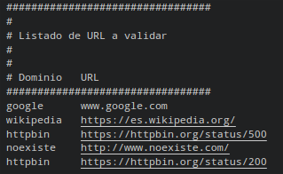
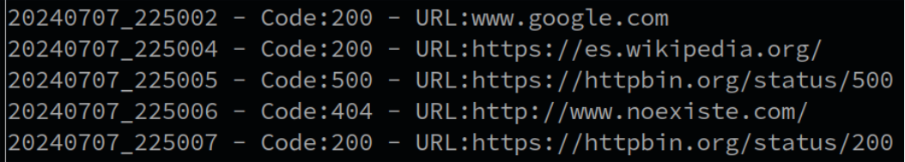
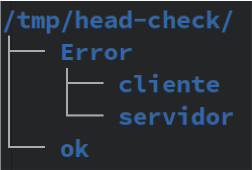
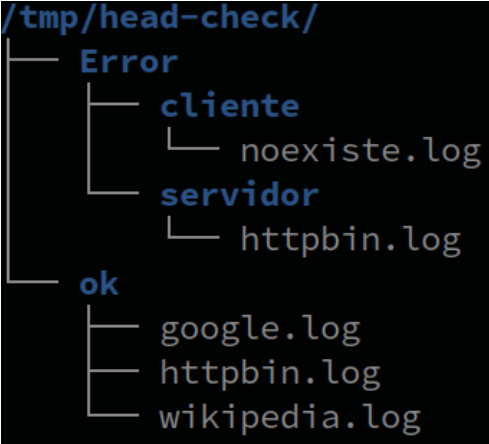

# check_URL

## Generalidades del funcionamiento

> Desarrollar un script para verificar el estado de un Listado de Dominios . </br>

- [ ] Parametros
  - Lista Dominios y URL
<div>
<table>
   <tr>
      <td></td>
   </tr>
</table>
</div>

- [ ] Debera Logear el status code de cada Dominio
  - Sobre un Log general
  - Dentro de un archivo con el nombre del dominio sobre una estructura de directorios.

- [ ]  Verificacion del status de un Dominio.
```sh
STATUS_CODE=$(curl -LI -o /dev/null -w '%{http_code}\n' -s "$URL")
```

## Detalles tecnicos
- [ ]  Registrar en /var/log/status_URL.log con el siguiente formato
<div>
<table>
   <tr>
      <td></td>
   </tr>
</table>
</div>

- [ ] Generar la siguietne Estructura de directorio con 1 solo comando

<div>
<table>
   <tr>
      <td></td>
   </tr>
</table>
</div>

- [ ]  Dejar un archivo `dominio`.log con la misma línea, en la carpeta segun el siguiente cuadro.

| STATUS_CODE 			| Carpeta 							| 
| ------                | ------ 							| 
| 200		| OK					| 
| de 400 a 499		| cliente					| 
| de 500 a 599		| servidor					| 

<div>
<table>
   <tr>
      <td></td>
   </tr>
</table>
</div>
